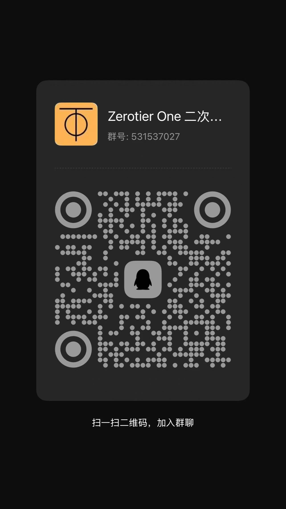

# ztResolve 🪐

中文 | [English](./README_EN.md)

---

**ztResolve** 是一款专为 **ZeroTier Planet** 设计的高级、高性能网页版离线网络拓扑配置生成、定制、签署及逆向解析工具箱。

该工具完全基于在浏览器 WebAssembly (WASM) 沙箱中运行的 Go 编译内核，免去了传统复杂的命令行构建环境搭建、Go/Rust 编译器安装等繁琐过程，提供 100% 离线、极速且安全的安全签署体验。

### ✨ 核心特性

- **🛡️ 100% 浏览器沙箱运行**: 基于 Go 编译至 WebAssembly 运行时。所有密码学运算、拓扑文件编译和解析均在您的浏览器本地执行，无任何后台网络请求，绝不泄露私钥。
- **🔄 双向编解码**:
  - **逆向解析**: 直接上传现有的二进制 `planet` 文件，Go WASM 引擎将即时对其进行反解，将全部 roots 根节点拓扑数据还原到交互式编辑器中。
  - **编译生成**: 交互式编辑根服务器 (Roots) 及其物理端点 (IP/Port)，并生成经过数字签名的 ZeroTier `planet` 二进制文件。
- **🔑 密钥与身份管理**:
  - 支持拖拽或上传现有的 Curve25519 节点私钥 (`identity.secret`)。
  - 支持现场动态生成全新的高安全强度 Curve25519 随机私钥。
  - 可安全导出备份您的私钥，或保存在 LocalStorage 中以便后续进行增量更新。
- **💎 现代质感视觉界面**: 基于 **Vite v5 + Tailwind CSS v4** 构建的响应式引导流布局，搭配背景霓虹微光粒子深度、极细微交互动效和纯黑美学体验。

### 🚀 快速开始

请确保您已安装 [Node.js](https://nodejs.org/) 环境。

1. **克隆仓库**:
   ```bash
   git clone https://github.com/NONGFAH/ztt.git
   cd ztt
   ```

2. **安装依赖**:
   ```bash
   npm install
   ```

3. **启动本地开发服务器**:
   ```bash
   npm run dev
   ```

4. **编译生产包**:
   ```bash
   npm run build
   ```

### 📁 项目结构

```text
ztResolve/
├── public/
│   ├── favicon.svg        # 站点图标
│   ├── qq.jpeg            # QQ 交流群二维码
│   ├── zfb.jpeg           # 支付宝赞赏码
│   ├── wasm_exec.js       # Go WASM 桥接运行时
│   └── main.wasm          # 预编译好的 Go WASM 编译器引擎
├── src/
│   ├── state.js           # 响应式中心状态机
│   ├── toast.js           # 质感弹窗消息组件
│   ├── uiRenderer.js      # 界面状态渲染器
│   ├── wasmLoader.js      # WASM 健壮自愈装载器
│   ├── style.css          # Tailwind CSS v4 样式入口
│   └── main.js            # 主程序控制流与 DOM 事件管理
├── index.html             # 全局布局结构
├── package.json           # 项目依赖与构建脚本
├── vite.config.js         # Vite 构建配置
└── LICENSE                # MIT 开源许可证
```

### 💬 交流与支持

- **QQ 交流群**：扫描下方二维码加入技术交流群：

  

- **赞赏与支持**：如果这个工具对您有所帮助，欢迎扫描赞赏码支持作者：

  

### 📝 开源许可证

本项目基于 [MIT 开源许可证](LICENSE) 发布。
